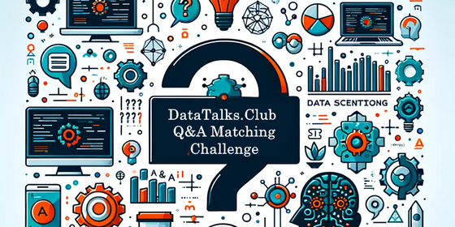

# DTC Zoomcamp Q&A Challenge

Hi there! This is my capstone 1 project for Machine Learning Zoomcamp 2023.



# Description

**Objective** : The primary goal is to develop a model that can accurately match a given question to its correct answer using the provided dataset. This challenge will test your skills in text processing, understanding contextual relationships, and dealing with varied data formats, including text and images.

**Background** : DataTalks.Club, a hub for data science learning, generates a significant amount of Q&A data through its courses. This competition aims to harness this data to create models that can automate the matching of questions to answers, enhancing educational resources and learner experiences.

**Impact** : Successful models from this competition could revolutionize how we manage the content, making it easier for learners to find the answers.

The data can downloaded from [kaggle](https://www.kaggle.com/competitions/dtc-zoomcamp-qa-challenge/data).

## About the dataset

The dataset for the DataTalks.Club Q&A Matching Challenge consists of four CSV files and an attachments folder. These files contain questions and answers from DataTalks.Club courses, along with relevant metadata. Participants are expected to use these files to develop models that can accurately match questions to their correct answers.

    1. train_questions.csv:
    **Purpose** : This file is used for training your model. It contains the questions along with metadata and the correct answer IDs.
    **Columns** :
    - question_id: A unique identifier for each question.
    - question: The text of the question.
    - course: The specific course from which the question was sourced.
    - year: The year in which the course was conducted.
    - candidate_answers: A list of answer IDs that are potential matches for the question.
    - answer_id: The ID of the actual correct answer for the question.
    
    2. train_answers.csv:
    **Purpose** : This file provides the answers for training, corresponding to the questions in train_questions.csv.
    **Columns** :
    - answer_id: A unique identifier for each answer.
    - answer: The text of the answer.
    - course: The specific course from which the answer was sourced.
    - year: The year in which the course was conducted.
    - attachments_files: Names of any attachment files related to the answer, including images.
    
    3. test_questions.csv:
    **Purpose** : Contains questions for evaluating your model's performance. It does not include the correct answer IDs.
    **Columns**: Same as train_questions.csv, but excluding the answer_id column.
    
    4. test_answers.csv:
    **Purpose** : Provides the answers for the test set. Participants need to match these answers to the questions in test_questions.csv.
    **Columns** : Same as train_answers.csv.
    
    5. Attachments Folder:
    **Contents** : Contains all the attachment files that are referenced in the answers. This includes images and potentially other types of files.
    **Usage** : These attachments are part of some answers and can be critical for correctly matching questions to answers, especially for questions where visual context is important.Participants are encouraged to explore and utilize the rich information available in these files, including textual content, course context, and temporal data, to develop robust models capable of accurately matching questions and answers.


## Files in repo
|  File name |      Description       |
|:--------:|:-----------------------------------:|
|    **data**   |  Folder with data and attachments|
|    **notebook.ipynb**   |  Data preparation and data cleaning; EDA, feature importance analysis; Model selection process and parameter tuning |
|    **model.bin**   |  saved model which is obtained as output of train.py |
|    **train.py**   |  Training the final model; Saving it to a file (e.g. pickle) or saving it with specialized software (BentoML) |
|    **predict.py**   |  Loading the model; Serving it via a web service (with Flask or specialized software - BentoML, KServe, etc)|
|    **predict_test.py**   |  a Python script that sends a request to the host with information about a video and returns a response that the video contains an opinion or statement |
|    **Pipfile**   |  python virtual environment management (pipenv) file with all the used packages and their versions listed (used for deployment)|
|    **Pipfile.lock**   |  python virtual environment management(pipenv) file specifying which specific version of the packages present in `Pipfile` should be used (used for deployment)|
|    **Dockerfile**   |  Dockerfile for running the service|
|    **README.md**   |  The file is an essential guide that gives other developers a detailed description of your GitHub project. | 


# How to run project

## Starter
    1. Download repo 
```
git clone  https://github.com/ol-pg/ml-zoomcamp/tree/main/capstone_project1
``` 
    2. Install dependencies with pipenv install

If you haven't installed `pipenv` yet, you need to do it with:
```
pip install pipenv
```
Then you can recreate the environment by running the below command in the project directory:
```
pipenv install
```

## To run train.py
    1. Activate virtual environment in directory by pipenv shell
    2. run python train.py , it will save model.bin in directory

## Deploy locally using docker
    1. run docker image using 
```
docker build . 
docker tag <your_image> predict
docker run -p 0.0.0.0:9696:9696 predict 
``` 
    2. run python predict_test.py on another command prompt


# Contacts
If you encounter any problem running any part of the project contact me at:

    - olgapogodina11@gmail.com

    - tg https://t.me/ol_pg

